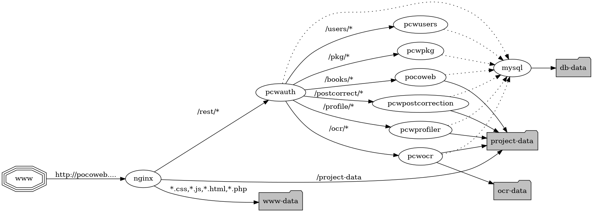

# Pocoweb

Pocoweb is a web based post-correction system for OCRed historical documents.
It is loosely based on [PoCoTo](https://github.com/cisocrgroup/PoCoTo).

Users can upload their OCRed documents and correct them in the web front end.
The corrected documents can then be downloaded and further processed.
Pocoweb understands various OCR formats that can be used.
Any corrections are written back into the original format of the documents.
This makes it possible to integrate the manual post-correction of OCRed documents
into other digitalisation workflows.

As PoCoTo, Pocoweb is connected with a language
[profiler](https://github.com/cisocrgroup/Profiler)
that enables semi-automatic correction of historical documents.
The profiler is able to differentiate between historical spelling variation
and real OCR errors in the documents and generates correction suggestions
for suspicious words.

- - -
## Table of contents

* [Users](#users-content-users)
* [Account settings](#user-content-account-settings)
* [User management](#user-content-user-management)
* [Projects](#user-content-projects)
    * [Uploading new projects](#user-content-upload-new-project)
	* [Project archives](#user-content-project-archives)
	* [Project table](#user-content-project-table)
	* [Downloading projects](#user-content-download-project)
	* [Profiling projects](#user-content-profile-project)
* [Post correction](#user-content-post-correction)
    * [Page correction](#user-content-page-correction)
    * [Navigation bar](#user-content-navigation-bar)
    * [Concordance view](#user-content-concordance-view)
* [Installation](#user-content-installation)
* [Services](#user-content-overview-services)
* [REST API](#user-content-rest-api)
    * [[GET] `rest-url`/api-version](#user-content-api-get-version)
    * [[POST] `rest-url`/login](#user-content-api-post-login)
    * [[GET] `rest-url`/login](#user-content-api-get-login)
	* [[POST] `rest-url`/users](#user-content-api-post-users)
	* [[GET] `rest-url`/users](#user-content-api-get-users)
	* [[PUT] `rest-url`/users/`uid`](#user-content-api-post-users-uid)
	* [[GET] `rest-url`/users/`uid`](#user-content-api-get-users-uid)
	* [[DELETE] `rest-url`/users/`uid`](#user-content-api-delete-users-uid)
	* [[GET] `rest-url`/books](#user-content-api-get-books)
	* [[POST] `rest-url`/books](#user-content-api-post-books)
	* [[GET] `rest-url`/books/`pid`](#user-content-api-get-books-pid)
	* [[POST] `rest-url`/books/`pid`](#user-content-api-post-books-pid)
	* [[DELETE] `rest-url`/books/`pid`](#user-content-api-delete-books-pid)
	* [[POST] `rest-url`/pkg/split/books/`pid`](#user-content-api-post-books-pid-split)
	* [[GET] `rest-url`/pkg/assign/books/`pid`](#api-get-books-pid-assign)
	* [[GET] `rest-url`/pkg/takeback/books/`pid`](#api-get-books-pid-takeback)
	* [[GET] `rest-url`/books/`pid`/adaptive-tokens](#user-content-api-post-books-pid-adaptive-tokens)
	* [[GET] `rest-url`/books/`pid`/download](#user-content-api-get-books-pid-download)
	* [[GET] `rest-url`/books/`pid`/search](#user-content-api-get-books-pid-search)
	* [[GET] `rest-url`/books/`pid`/pages/`pageid`](#user-content-api-get-books-pid-pages-pageid)
	* [[DELETE] `rest-url`/books/`pid`/pages/`pageid`](#user-content-api-delete-books-pid-pages-pageid)
	* [[GET] `rest-url`/books/`pid`/pages/first](#user-content-api-get-books-pid-pages-first)
	* [[GET] `rest-url`/books/`pid`/pages/last](#user-content-api-get-books-pid-pages-last)
	* [[GET] `rest-url`/books/`pid`/pages/`pageid`/next/`n`](#user-content-api-get-books-pid-pages-pageid-next-n)
	* [[GET] `rest-url`/books/`pid`/pages/`pageid`/prev/`n`](#user-content-api-get-books-pid-pages-pageid-prev-n)
	* [[GET] `rest-url`/books/`pid`/pages/`pageid`/lines/`lid`](#user-content-api-get-books-pid-pages-pageid-lines-lid)
	* [[POST] `rest-url`/books/`pid`/pages/`pageid`/lines/`lid`](#user-content-api-post-books-pid-pages-pageid-lines-lid)
   * [[DELETE] `rest-url`/books/`pid`/pages/`pageid`/lines/`lid`](#user-content-api-delete-books-pid-pages-pageid-lines-lid)
	* [[POST] `rest-url`/books/`pid`/pages/`pageid`/lines/`lid`/tokens/`tid`](#user-content-api-post-books-pid-pages-pageid-lines-lid-tokens-tid)
	* [[GET] `rest-url`/profile/books/`pid`](#user-content-api-get-books-pid-profile)
	* [[POST] `rest-url`/profile/books/`pid`](#user-content-api-post-books-pid-profile)
	* [[POST] `rest-url`/profile/suspicious/books/`pid`](#user-content-api-get-books-pid-suspicious)
	* [[GET] `rest-url`/profile/languages](#user-content-api-get-profiler-languages)
	* [[GET] `rest-url`/ocr](#user-content-api-get-global-ocr-models)
	* [[GET] `rest-url`/ocr/books/`pid`](#user-content-api-get-ocr-models)
	* [[POST] `rest-url`/ocr/books/`pid`](#user-content-api-post-ocr-book)
	* [[POST] `rest-url`/ocr/books/`pid`/pages/`pageid`](#user-content-api-post-ocr-book-page)
	* [[POST] `rest-url`/ocr/books/`pid`/pages/`pageid`/lines/`lineid`](#user-content-api-post-ocr-book-page-line)
	* [[GET] `rest-url`/postcorrect/el/books/`pid`](#user-content-api-get-el)
	* [[POST] `rest-url`/postcorrect/el/books/`pid`](#user-content-api-post-el)
	* [[GET] `rest-url`/postcorrect/rrdm/books/`pid`](#user-content-api-get-rrdm)
	* [[POST] `rest-url`/postcorrect/rrdm/books/`pid`](#user-content-api-post-rrdm)
	* [[GET] `rest-url`/jobs/`jobid`](#user-content-api-get-jobs)

- - -
<a id='users'></a>
## Users

In order to use Pocoweb, each user has to login in the
[login page](/login.php) using her user name and password.

There are two kinds of user accounts in Pocoweb, that have
different permissions in the system:

1. Administrator accounts
    * Create new administrator and normal users accounts
    * Delete user accounts
    * Upload new documents and create new [projects](#user-content-project-management)
    * Split projects into [packages](#user-content-project-management)
    * Assign packages to different user accounts
    * Profile projects.
    * Post correct projects and packages.
    * Delete documents and packages.
    * Download corrected projects

2. Normal user accounts
    * Post correct packages that where assigned to them
    * Profile projects.
    * Reassign packages back to their original owner.

- - -
<a id='account-settings'></a>
## Account settings

Users can manage their account settings using the [Account](/account.php) tab.
They can only manage their own user's settings. It is not possible to change
the settings of another user account even if you are logged in with an
administrator account.

In order to update user settings or to change the user's password, fill in
or change the appropriate fields and click on the
 button.

If you want to delete your account click on the
 button.
This will delete the user and all its projects and packages.
Use with caution.

Note that using the account settings is the only way to delete
an administrator account (see
[User management](#user-content-user-management) below).

- - -
<a id='user-management'></a>
## User management

User management is done via the [Users](/users.php) tab.
You have to be logged in with an administrator account in order
to access and use the user management page.

The user management page consist of a mask to create new users and
a user table that lists all existing users. To create a new user,
fill out the input fields accordingly and then click to the
 button.
If the account should be an administrator account, do not forget to
check the  check box.

After the mask follows the user table.
In order to remove an user account click on the
 button in the according user entry
in the user table.
It is not possible at the moment to delete an existing administrator account;
only regular user accounts can be deleted.

To delete an administrator account log in with this account, go to the
[Account](/account.php) tab and click to the

button (see [Account settings](#user-content-account-settings) above).

- - -
<a id='projects'></a>
## Projects

Project management is done via the [Projects](/index.php) tab.
On this page you can manage the projects and packages (see below) that your
user owns.
n
Pocoweb uses two different kinds of correctable documents.
*Projects* on the one hand represent whole documents that should be corrected.
*Packages* on the other hand are smaller subsets of projects that contain
a smaller subset of the pages of their parent project.
Two packages with the same parent never contain overlapping pages.
This makes it possible for two different users to correct different packages
of the same project in parallel.

Only administrators can upload new projects, split them into a number of
packages and assign those packages to different users.
It is not possible to assign a project to a different user.

*Note: Since is possible to correct a whole project as well,
one should never correct a project while other users could be correcting
an associated package.
This could lead to cases where one user accidentally
overrides an other users work.*

<a id='upload-new-project'></a>
### Uploading new projects

If you are logged in with an administrator account, you can create a new project.
Fill in the meta data fields in the mask, select the according
[project archive](#user-content-project-archives) on your computer and click
on the  button.
Depending on the size of the project archive,
the uploading of the project can take a while.

The [Pocoweb back-end](#user-content-pocoweb-backend) analyzes the project archive,
processes its OCR and image files and publishes the project.
If the uploading was successfully, you should see the new project in the
project table.

The project's author, title and year can be filled out as it seems fit.
Theses values are not used internally and are there for an easy reference.

A project's profiler and its language are settings specific for the language
profiler.
If you plan to use a profiler for the post correction of your project, you
have to set them accordingly.
If the installation of Pocoweb comes with a local configured profiler,
you can use `default` or `local` as value for your profiler.
If not or if you want to use another profiler, you have to specify its URL.

Do not forget to set the right language for the new project.
The language field lists all available languages for your chosen profiler.

<a id='project-archives'></a>
### Project archives

A project archive is a zipped directory structure that contains the OCR and
image files for the pages of a document.
Image files should be encoded as PNG files if possible, but specify or TIFF
encoded images are fine, too.
The OCR files should be either
[ABBYY-XML](),
[ALTO-XML]() or
[hOCR]()
encoded files.

The back-end tries its best to automatically search and order the pages
in project archives.
Therefore the matching OCR and image files should have the same name
(without the extension).
It does not matter in which directory structure the different image and OCR
files reside.
If the matching OCR and image files do have the same filenames for any reason,
you can add a [METS/MOTS]() meta data file to the archive, in which the
page ordering and the association between image and OCR files is specified.

Example structure of a project archive:

```
archive
├── img
│   ├── page-0001.png
│   ├── page-0002.png
│   └── page-0003.png
└── ocr
    ├── page-0001.xml
    ├── page-0002.xml
    └── page-0003.xml
```

There is no need to separate the image and OCR files with different directories.
You can also use a flat directory structure:
```
archive
├── page-0001.png
├── page-0001.xml
├── page-0002.png
├── page-0002.xml
├── page-0003.png
└── page-0003.xml
```

It is also possible to have the files in a page directory structure like this:
```
archive
├── page-0001
│   ├── page.xml
│   └── page.png
├── page-0003
│   ├── page.xml
│   └── page.png
└── page-0002
    ├── page.xml
    └── page.png
```

If you use [ocropy](https://github.com/tmbdev/ocropy),
you can also use its project structure directly to upload a project archive:
```
archive
└── book
    ├── 0001.png
    ├── 0001
    │   ├── 010001.bin.png
    │   ├── 010001.txt
    │   └─ ...
    ├── 0002.png
    ├── 0002
    │   ├── 010001.bin.png
    │   ├── 010001.txt
    │   └─ ...
    ├── 0003.png
    └── 0003
        ├── 010001.bin.png
        ├── 010001.txt
        └─ ...
```

<a id='project-table'></a>
### Project table

After the create project mask, a table with all the projects
and packages that you own is shown.
If you are logged in with an administrator account you see all your uploaded
projects and all packages that you have not yet assigned to another user.
If you are logged in with a normal user account, you only see the packages
that have been assigned to you.

You can manage the projects by clicking on the according buttons
in the rows of the table:

1. Click on the  button to open
the project and start [correcting](#user-content-post-correction) it.

2. Click on the  button
to [download](#user-content-download-project) the project.

3. Click on the  button
to remove the project.

4. Click on the  button to
order a [document profile](#user-content-profile-project).

5. Click on the  button
to open a list of all [adptive tokens](#user-content-profile-project).

6. Click on the  button
to split the project into multiple packages.

7. Click on the 
button to assign a package to an user.

<a id='download-project'></a>
### Downloading projects

You can click on the 
button in the project table to download a project.
The pocoweb back-end will then generate a project archive and give
you a link from where you can download it.

The project archive will retain the same structure as the project archive,
that was used to create the project. All corrections are written back into
the original OCR files.

Additionally the archive contains a list of all adaptive tokens of the last
profiler run over the document and a page an line segmented directory structure,
that can directly be used with ocropy.

<a id='profile-project'></a>
### Profiling projects

You can order a document profile by clicking on the
 button in the project
table. This will start a profiler that profiles the document. The profiler
uses the language settings that where given when the profject was created.

The profiling is done in the background. If the profiling is done,
various helpers are available for the post correction of the profiled project
and its associated packages.

After the profiling is done, you can inspect the list of *adaptive tokens*.
Just click to the

button on the project table.

Adaptive tokens are generated by the profiler.
Whenever a corrected token is found during the profiling,
the profiler tries to match the correction to a known dictionary entry.
If no such match can be generated, a new adaptive token is generated and
inserted into a temporary dictionary for this document. For this reason
Adaptive tokens are possible candidates for new dictionary entries.

For more information about the profiling and adaptive tokens
see the [profiler paper]() and [profiler paper 2]()

- - -
<a id='post-correction'></a>
## Post correction

In order to correct a project or package click to the
 button.
Pocoweb opens the first page of the project or package
and presents the page correction view.
In generally the post correction is the same for projects an packages.
Every statement about the correction of projects also applies to the
correction of packages.

Other than PoCoTo the post correction with Pocoweb is line based.
Generally you correct whole lines of the document and not single tokens.
The page correction view presents the lines of the document and lets
you correct each line individually.

<a id='page-correction'></a>
### Page correction

The page correction view shows the lines of a page of the project.
You can use the forward and backward buttons of the navigation bar
to go to the next, previous first and last pages of the project.

For each line the image of the line and the according OCR text are shown.
If the project has been profiled, *suspicious tokens* (tokens that the profiler
thinks are real OCR errors) are marked red in the text.
The suspicious tokens are meant to give you a visual clue about errors on
the page.

You can click on the line image to see an overview over the whole line's page image.
If you click in the text you can edit the text.
It is also possible to select single tokens in a line, by marking them with
the mouse. If a token is selected, you can choose a correction candidate for
it or list all occurrences of the token in the
[navigation bar](#user-content-navigation-bar).

After you have corrected a line you can click on the
 button to correct the line and
send the correction to the back-end (you can also click on the button on the
button of the page to correct all lines of a page).
After the line is corrected it is shown with a green background.

In general if a line was corrected it is shown with a green background.
If a line was partially corrected (see
[concordance view](#user-content-concordance-view) below)
the background is yellow and
if the line was not yet touched it has a white background.

<a id='navigation-bar'></a>
### Navigation bar

The navigation bar lets you navigate the pages of you project.
It stays on top of your browser's screen even while you navigate down the
browser page.

Besides the navigation buttons, the navigation bar shows a tab to list
the assumed error patterns and error tokens of the project.
If the project was profiled these list assumed errors in the document
by the number of their occurrence or by their common error patterns.
Click one of the entries to open the
[concordance view](#user-content-concordance-view) of the according token
or error patterns.

If a token is selected it shows the concordance count of the token.
If the document was profiled you can use the correction suggestion tab to
select a correction candidate for the selected token.
The selected token with one of the listed correction suggestions.

<a id='concordance-view'></a>
### Concordance view

The concordance view lists similar tokens of the whole project and
shows them in their respective line context. With the concordance
view you can correct a series of tokens at once.
If you do this each token of the concordance view is corrected
in the lines.
In this way the corrected lines become *partially corrected*,
since not the whole line was corrected but just a token in the line.

You can correct each token individually.
Just edit the token and then click to the
 button.
If you want to correct multiple occurrences of the tokens in
the concordance view you can either set a global correction
in the concordance bar

or select a correction suggestion using the

selection for each individual token.

Before you correct all tokens in a series make sure, that only the
tokens you want to correct are checked.

- - -
<a id='installation'></a>
## Installation
Pocoweb is open source software and is distributed under the
[Apache 2.0](LICENSE) license.
You can download the source code from its
[github repository](http://github.com/cisocrgroup/pocoweb).
Installation instructions can be found in the project's
[README](https://github.com/cisocrgroup/pocoweb/blob/master/README.md)
file.

- - -
<a id='overview-services'></a>
## Services
Pocoweb is composed with a number of interdependend services:
* nginx serves images, web-content and redirectes API calls
* pcwauth authentificates API requests and forwards them to the various other services
* mysql holds all database tables
* pocoweb manages project, packages and the up- and download
* www-data is a directory (volume) that holds the frontend
* project-data is a directory (volume) that holds the project files
* db-data is a directory (volume) that holds the database files
* ocr-data is a direcotry (volume) that holds the global ocr models
* pcwuser handles user management
* pcwprofiler handles profiling of projects
* pcwpostcorrection handles the automatic postcorrection
* pcwocr handles ocr prediction and training
* pcwpkg handles splitting and assignment of packages


- - -
<a id='rest-api'></a>
## REST API

The REST API documentation lists the available URLs of Pocoweb's REST API.
Each entry gives the request method (GET, POST or DELETE) in square brackets,
the request path and the layout of the response data is listed.
Additionally for POST requests the expected layout of the POST data is listed.
You have to replace the parameters in the request path
by valid ids:
 * `uid` references a valid user id.
 * `pid` references a valid project or package id.
 * `pageid` references a valid page id in a project or package.
 * `lid` references a valid line id on a page.
 * `tid` references a valid token id on a line.

You have to be logged in with a valid user account
(see [Authorization](#user-content-authorization) below).

All URLs in the API documentation reference a `rest-url`.
You have to set this parameter for your back-end accordingly.
So for example the back-end URL for this site is <code><?php global $config; echo $config['backend']['externalURL'];?></code>.
This means that you have to replace the occurences of `rest-url`
in the paths of the REST API documentation with
<code><?php global $config; echo $config['backend']['externalURL'];?></code>.

<a id='authorization'></a>
### Authorization

You have to be authenticated for most of the API calls.
If you are not authenticated the API will return `403 Forbidden`
with no response data.

In order to authenticate you first have to
[login](#user-content-api-post-login) with a valid user account at the
back-end.  The login will return an unique session id token.  You have
to send this session token using an additional `auth=id` parameter for
each API call.

For example if your session id is `my-session-id` you have to append
the `auth=my-session-id` to any URL. So for example using `curl`, you
would need to call `curl
rest-url/books/pid/pages/pageid?auth=my-session-id`.

In order to get the 13-th line of the 38-th page of a project with an id of 27
from this Pocoweb back-end using curl you would have to run:

<code>curl <?php global $config; echo
$config['backend']['externalURL'];?>/books/27/pages/38/lines/13?auth=my-session-id</code>

---
<a id='api-get-version'></a>
### [GET] `rest-url`/api-version

Get the semantic version of the back-end instance.
* No [authorization](#user-content-authorization) is required.

#### Response data
```json
{
  "version": "1.2.3"
}
```

---
<a id='api-post-login'></a>
### [POST] `rest-url`/login
You have to log in with a valid user account to use most of the API calls
(see [authorization](#user-content-authorization) above).
No [authorization](#user-content-authorization) is required.

After a successfully login you can use the returned session id in the
`Authorization` header of your future API calls.

#### POST data
```json
{
  "email": "user email",
  "password": "password"
}
```

#### Response data
```json
{
  "auth": "auth-token",
  "user": {
	"id": 42,
    "name": "user-name",
    "email": "user-email",
    "insitute": "user-institute",
    "admin": true|false
  }
}
```

---
<a id='api-get-login'></a>
### [GET] `rest-url`/login
Check if logged in and get the settings of the logged in user account.
* [Authorization](#user-content-authorization) is required.

#### Response data
```json
{
  "id": 42,
  "name": "user-name",
  "email": "user-email",
  "insitute": "user-institute",
  "admin": true|false
}
```

---
<a id='api-post-users'></a>
### [POST] `rest-url`/users
Create a new user account.
* [Authorization](#user-content-authorization) is required.
* Only administrators can create new user accounts.

#### POST data
```json
{
	"user": {
	    "id": 0,
		"name": "user-name",
		"email": "user's unique email",
		"insitute": "user-institute",
		"admin": true|false
	},
	"password": "new user's password"
}
```

#### Response data
```json
{
  "id": 42,
  "name": "user-name",
  "email": "user-email",
  "insitute": "user-institute",
  "admin": true|false
}
```

---
<a id='api-get-users'></a>
### [GET] `rest-url`/users
Get a list of all users in the system.
* [Authorization](#user-content-authorization) is required.
* Only administrators can list all user accounts.

#### Response data
```json
{
  "users": [
    {
      "id": 42,
      "name": "user-name-1",
      "email": "user-email-1",
      "insitute": "user-institute-1",
      "admin": true|false
    },
    {
      "id": 42,
      "name": "user-name-2",
      "email": "user-email-2",
      "insitute": "user-institute-2",
      "admin": true|false
    },
	...
  ]
}
```


---
<a id='api-post-users-uid'></a>
### [PUT] `rest-url`/users/`uid`
Update the account settings of an user with an id of `uid`.
* [Authorization](#user-content-authorization) is required.
* Administrators can update any normal user account.
* Every user can change his own user account.
* You cannot change the type (administrator or normal) of an user account.

#### POST data
```json
{
	"user": {
	    "id": 42,
		"name": "user-name",
		"pass": "password",
		"email": "user-email",
		"insitute": "user-institute"
	},
	"password": "user's new password"
}
```
You can leave out the password or use the empty string,
if you do not want to update the user's password. It is
not possible to change a user's id.

#### Response data
```json
{
  "id": 42,
  "name": "updated-user-name",
  "email": "updated-user-email",
  "insitute": "updated-user-institute",
  "admin": true|false
}
```

---
<a id='api-get-users-uid'></a>
### [GET] `rest-url`/users/`uid`

Get the settings of an user account with an id of `uid`.
* [Authorization](#user-content-authorization) is required.
* Administrators can get the settings of any normal user account.
* Every user can get the settings of her own user account.

#### Response data
```json
{
  "id": 42,
  "name": "user-name",
  "email": "user-email",
  "insitute": "user-institute",
  "admin": true|false
}
```

---
<a id='api-delete-users-uid'></a>
### [DELETE] `rest-url`/users/`uid`
Delete the user account of the user with an id of `uid`.
* [Authorization](#user-content-authorization) is required.
* Administrators can delete any user account.
* Every user can delete her own user account.

If an user account is deleted, any projects and or packages,
that the user owned are deleted.
Since packages just define a subset of a project, the deletion of packages
deletes the package information, but not the project information.
It is save to delete a user that still owns a package.
Note that if a project is deleted, all associated packages are deleted as well.

---
<a id='api-get-books'></a>
### [GET] `rest-url`/books
Get all books of an user account.
* [Authorization](#user-content-authorization) is required.

#### Response data
```json
{
  "books": [
    {
      "author": "book-author",
      "title": "book-title",
      "year": 1234,
      "language": "language",
      "profilerUrl": "profiler-url|local",
      "bookId": 27,
      "projectId": 42,
      "pages": 100,
      "pageIds": [15,18,20,27,...],
      "isBook": true|false
    },
    ...
  ]
}
```

---
<a id='api-post-books'></a>
### [POST] `rest-url`/books
Create a new project.
* [Authorization](#user-content-authorization) is required.
* Only administrators can upload new projects.
* There are two kinds of post requests:
  1. Raw upload of [project archive](#user-content-project-archives).
  2. Upload of local [project archive](#user-content-project-archives).

#### POST raw data
The raw data of the zipped [project
archive](#user-content-project-archives). Use `Content-Type:
application/zip` as request header.

#### POST local data
Use `Content-Type: application/json` as request header.
```json
{
  "author": "book-author",
  "title": "book-title",
  "year": 1234,
  "language": "language",
  "profilerUrl": "profiler-url|local",
  "file": "/path/to/server-local/file
}
```

---
<a id='api-get-books-pid'></a>
### [GET] `rest-url`/books/`pid`
Get the content of a project or package.
* [Authorization](#user-content-authorization) is required.
* Only the owner of a project or package can access the project's or package's data.

#### Response data
```json
{
  "author": "book-author",
  "title": "book-title",
  "year": 1234,
  "language": "language",
  "profilerUrl": "profiler-url|local",
  "bookId": 27,
  "projectId": 42,
  "pages": 100,
  "pageIds": [15,18,20,27,...],
  "status": {
	"profile": true,
	"extended-lexicon": false,
	"post-corrected": false
  },
  "isBook": true|false
}
```

---
<a id='api-post-books-pid'></a>
### [POST] `rest-url`/books/`pid`
Update the meta data of a project.
* [Authorization](#user-content-authorization) is required.
* Only the owner of a project can update the project's data.
* Fields can be ommitted.

#### POST data
```json
{
  "author": "book-author",
  "title": "book-title",
  "year": 1234,
  "language": "language",
  "profilerUrl": "profiler-url|local"
}
```

---
<a id='api-delete-books-pid'></a>
### [DELETE] `rest-url`/books/`pid`
Delete a project.
* [Authorization](#user-content-authorization) is required.
* Only the owner of a project can delete a project.

If a project is deleted, all associated packages are deleted as well.
It is not possible to delete a package.
The deletion remove all database entries of the projects and all
associated packages.
In addition to this the page and line images and all remaining project
archives are removed from the server.

---
<a id='api-post-books-pid-split'></a>
### [POST] `rest-url`/pkg/split/books/`pid`
Split a [project into packages](#user-content-projects).
* [Authorization](#user-content-authorization) is required.
* Only the owner of a project can split a project into packages.

#### Post data
```json
{
  "userIds": [1, 2, 3],
  "random": true|false
}
```
* The mandatory argument `ids` specifies an not empty array of user
  ids. The split route creates that many packages and assignes them to
  the given users.  User-IDs in the `ids` array need not be unique.
* The optional argument `random` specifies if the pages of the
  packages should be generated at random or sequential.  If omitted
  `random=false` is assumed.

#### Response data
```json
{
  "bookId": 19
  "projects": [
    {
	  "projectId": 38,
	  "owner": 17,
	  "pageIds": [15, 16, ...]
	},
	...
  ]
}
```

---
<a id='api-get-books-pid-assign'></a>
### [GET] `rest-url`/pkg/assign/books/`pid`
Assign a packages to users.
* [Authorization](#user-content-authorization) is required.
* Only an administrator can assign packages to different users.
* Only the owner of a package can assign it back to its original
  owner.

#### Query parameters
* The id of the user to which the package should be assigned,
  must be given with the `assignto=user-id` parameter.
* If the parameter `assignto` is ommited, the package is assigned to
  the original owner of the package (the owner of the associated
  project).

---
<a id='api-get-books-pid-takeback'></a>
### [GET] `rest-url`/pkg/takeback/books/`pid`
Take all packages of a project back.  All packages beloning to the
project are reasigned to the project's owner.
* [Authorization](#user-content-authorization) is required.
* Only the owner of a project can take packages back.

---
<a id='api-post-books-pid-adaptive-tokens'></a>
### [GET] `rest-url`/books/`pid`/adaptive-tokens
Get a list of the adaptive tokens of the last profiler run.
* [Authorization](#user-content-authorization) is required.
* Only the owner of a project can access the adaptive token set of the project.

#### Response data
```json
{
  "projectId": 27,
  "adaptiveTokens": ["token1", "token2", ...]
}
```

---
<a id='api-get-books-pid-download'></a>
### [GET] `rest-url`/books/`pid`/download
Download a project.
* [Authorization](#user-content-authorization) is required.
* Only the owner of a project can delete a project.

This API call generates a new project archive and returns
the relative URL of the new archive.
The new project contains all original OCR and image files with
all corrections.
Additionally the archive contains a file called `adaptive_tokens.txt` as well
as a `ocropus-book` directory structure.

The file `adaptive_tokens.txt` contains the
[adaptive token set](#user-content-profile-project) of the various
profiler runs (if any). This file can be empty, if no profiling was used or
if the profiler could not find any adaptive tokens.

The `ocorpus-book` directory contains an
[ocropy directory structure](#user-content-project-archives)
that can directly be used for model training with ocropy.
If the project archive was already a ocropy directory structure,
only the according ground truth files are updated.

#### Response data
```json
{
  "archive": "relative download url of project archive",
}
```

---
<a id='api-get-books-pid-search'></a>
### [GET] `rest-url`/books/`pid`/search
Search for a token or error pattern in a project or package with id `pid`.
* [Authorization](#user-content-authorization) is required.
* Only the owner of a project or package can search for tokens or error patterns.

#### Query parameters
* The query is given with the `q=query` parameter. This parameter is mandatory.
* The optional parameter `p=1|0` specifies if a token search or a error pattern
search should be performed (default: `p=0`).
* The optional parameter `max=n` sets the maximal number of returned
  hits (default: `max=50`).
* The optional parameter `skip=n` sets the number of hits to skip
  (default: `skip=0`).

#### Response data
```json
{
  "projectId": 27,
  "bookId": 17,
  "isErrorPattern": true|false,
  "skip": 8,
  "max": 14,
  "totalCount": 1000,
  "matches": {
	"query1": [{
	   "totalCount": 30,
	   "line": {
          "lineId": 13,
          "pageId": 38,
          "projectId": 27,
          "imgFile": "path/to/line/image/file",
          "cor": "corrected content",
          "ocr": "ocr content",
          "cuts": [1, 3, 5, 7, 9, 11, ...],
          "confidences": [0.1, 0.1, 0.9, 1.0, ...],
          "averageConfidence": 0.5,
          "isFullyCorrected": true|false,
          "isPartiallyCorrected": true|false,
          "box": {
            "left": 1,
            "right": 2,
            "top": 3,
            "bottom": 4,
            "width": 1,
            "height": 1
          }
        }
		},...],
		"matches": [{
          "projectId": 27,
          "pageId": 38,
          "lineId": 13,
          "tokenId": 17,
          "offset": 8,
          "isFullyCorrected": true|false,
          "isPartiallyCorrected": true|false,
          "cor": "corrected content of token",
          "ocr": "ocr content of token",
          "averageConf": 0.3,
          "isNormal": true|false,
          "box": {
            "left": 1,
            "right": 2,
            "top": 3,
            "bottom": 4,
            "width": 1,
            "height": 1
          }},...
		]
	}
}
```

---
<a id='api-get-books-pid-pages-pageid'></a>
### [GET] `rest-url`/books/`pid`/pages/`pageid`
Get the content of a page with id `pageid` of a package or project with id `pid`.
* [Authorization](#user-content-authorization) is required.
* Only the owner of a project or package can read its pages.

#### Response data
```json
{
  "pageId": 38,
  "projectId": 27,
  "ocrFile": "name of ocr file",
  "imgFile": "name of image file",
  "box": {
    "left": 1,
    "right": 2,
    "top": 3,
    "bottom": 4,
    "width": 1,
    "height": 1
  },
  "lines": [
    {
      "lineId": 13,
      "pageId": 38,
      "projectId": 27,
      "imgFile": "path/to/line/image/file",
      "cor": "corrected content",
      "ocr": "ocr content",
      "cuts": [1, 3, 5, 7, 9, 11, ...],
      "confidences": [0.1, 0.1, 0.9, 1.0, ...],
      "averageConfidence": 0.5,
      "isFullyCorrected": true|false,
      "isPartiallyCorrected": true|false,
      "box": {
        "left": 1,
        "right": 2,
        "top": 3,
        "bottom": 4,
        "width": 1,
        "height": 1
      }
      "tokens": [
        {
          "projectId": 27,
          "pageId": 38,
          "lineId": 13,
          "tokenId": 17,
          "offset": 8,
          "isFullyCorrected": true|false,
          "isPartiallyCorrected": true|false,
          "cor": "corrected content of token",
          "ocr": "ocr content of token",
          "averageConf": 0.3,
          "isNormal": true|false,
          "box": {
            "left": 1,
            "right": 2,
            "top": 3,
            "bottom": 4,
            "width": 1,
            "height": 1
          },
        },
        ...
      ]
	}
  ]
}
```

---
<a id='api-delete-books-pid-pages-pageid'></a>
### [DELETE] `rest-url`/books/`pid`/pages/`pageid`
Delete the pages with `pageid` from the project with id `pid`.
* [Authorization](#user-content-authorization) is required.
* Only pages from projects can be deleted.  You cannot delete pages
  from packages.
* Only the owner of a project can delete it.

---
<a id='api-get-books-pid-pages-first'></a>
### [GET] `rest-url`/books/`pid`/pages/first
Get the first page of a project or package with id `pid`.
* [Authorization](#user-content-authorization) is required.
* Only the owner of a project or package can read its pages.

#### Response data
```json
{
  "pageId": 38,
  "projectId": 27,
  "ocrFile": "name of ocr file",
  "imgFile": "name of image file",
  "box": {
    "left": 1,
    "right": 2,
    "top": 3,
    "bottom": 4,
    "width": 1,
    "height": 1
  },
  "lines": [
    {
      "lineId": 13,
      "pageId": 38,
      "projectId": 27,
      "imgFile": "path/to/line/image/file",
      "cor": "corrected content",
      "ocr": "ocr content",
      "cuts": [1, 3, 5, 7, 9, 11, ...],
      "confidences": [0.1, 0.1, 0.9, 1.0, ...],
      "averageConfidence": 0.5,
      "isFullyCorrected": true|false,
      "isPartiallyCorrected": true|false,
      "box": {
        "left": 1,
        "right": 2,
        "top": 3,
        "bottom": 4,
        "width": 1,
        "height": 1
      }
    },
    ...
  ]
}
```
---
<a id='api-get-books-pid-pages-last'></a>
### [GET] `rest-url`/books/`pid`/pages/last
Get the last page of a project or package with id `pid`.
* [Authorization](#user-content-authorization) is required.
* Only the owner of a project or package can read its pages.

#### Response data
```json
{
  "pageId": 38,
  "projectId": 27,
  "ocrFile": "name of ocr file",
  "imgFile": "name of image file",
  "box": {
    "left": 1,
    "right": 2,
    "top": 3,
    "bottom": 4,
    "width": 1,
    "height": 1
  },
  "lines": [
    {
      "lineId": 13,
      "pageId": 38,
      "projectId": 27,
      "imgFile": "path/to/line/image/file",
      "cor": "corrected content",
      "ocr": "ocr content",
      "cuts": [1, 3, 5, 7, 9, 11, ...],
      "confidences": [0.1, 0.1, 0.9, 1.0, ...],
      "averageConfidence": 0.5,
      "isFullyCorrected": true|false,
      "isPartiallyCorrected": true|false,
      "box": {
        "left": 1,
        "right": 2,
        "top": 3,
        "bottom": 4,
        "width": 1,
        "height": 1
      }
    },
    ...
  ]
}
```

---
<a id='api-get-books-pid-pages-pageid-next-n'></a>
### [GET] `rest-url`/books/`pid`/pages/`pageid`/next/`n`
Get the `n`-th next page of a page with id `pageid` of a project or package with id `pid`.
* [Authorization](#user-content-authorization) is required.
* Only the owner of a project or package can read its pages.

#### Response data
```json
{
  "pageId": 38,
  "projectId": 27,
  "ocrFile": "name of ocr file",
  "imgFile": "name of image file",
  "box": {
    "left": 1,
    "right": 2,
    "top": 3,
    "bottom": 4,
    "width": 1,
    "height": 1
  },
  "lines": [
    {
      "lineId": 13,
      "pageId": 38,
      "projectId": 27,
      "imgFile": "path/to/line/image/file",
      "cor": "corrected content",
      "ocr": "ocr content",
      "cuts": [1, 3, 5, 7, 9, 11, ...],
      "confidences": [0.1, 0.1, 0.9, 1.0, ...],
      "averageConfidence": 0.5,
      "isFullyCorrected": true|false,
      "isPartiallyCorrected": true|false,
      "box": {
        "left": 1,
        "right": 2,
        "top": 3,
        "bottom": 4,
        "width": 1,
        "height": 1
      }
    },
    ...
  ]
}
```

---
<a id='api-get-books-pid-pages-pageid-prev-n'></a>
### [GET] `rest-url`/books/`pid`/pages/`pageid`/prev/`n`
Get the `n`-th previous page of a page with id `pageid` of a project or package with id `pid`.
* [Authorization](#user-content-authorization) is required.
* Only the owner of a project or package can read its pages.

#### Response data
```json
{
  "pageId": 38,
  "projectId": 27,
  "ocrFile": "name of ocr file",
  "imgFile": "name of image file",
  "box": {
    "left": 1,
    "right": 2,
    "top": 3,
    "bottom": 4,
    "width": 1,
    "height": 1
  },
  "lines": [
    {
      "lineId": 13,
      "pageId": 38,
      "projectId": 27,
      "imgFile": "path/to/line/image/file",
      "cor": "corrected content",
      "ocr": "ocr content",
      "cuts": [1, 3, 5, 7, 9, 11, ...],
      "confidences": [0.1, 0.1, 0.9, 1.0, ...],
      "averageConfidence": 0.5,
      "isFullyCorrected": true|false,
      "isPartiallyCorrected": true|false,
      "box": {
        "left": 1,
        "right": 2,
        "top": 3,
        "bottom": 4,
        "width": 1,
        "height": 1
      }
    },
    ...
  ]
}
```

---
<a id='api-get-books-pid-pages-pageid-lines-lid'></a>
### [GET] `rest-url`/books/`pid`/pages/`pageid`/lines/`lid`
Get the line with id `lid` of a page with id `pageid` from a project
or package with id `pid`.
* [Authorization](#user-content-authorization) is required.
* Only the owner of a project or package can read its lines.

#### Response data
```json
{
  "lineId": 13,
  "pageId": 38,
  "projectId": 27,
  "imgFile": "path/to/line/image/file",
  "cor": "corrected content",
  "ocr": "ocr content",
  "cuts": [1, 3, 5, 7, 9, 11, ...],
  "confidences": [0.1, 0.1, 0.9, 1.0, ...],
  "averageConfidence": 0.5,
  "isFullyCorrected": true|false,
  "isPartiallyCorrected": true|false,
  "box": {
    "left": 1,
    "right": 2,
    "top": 3,
    "bottom": 4,
    "width": 1,
    "height": 1
  }
}
```

---
<a id='api-post-books-pid-pages-pageid-lines-lid'></a>
### [POST] `rest-url`/books/`pid`/pages/`pageid`/lines/`lid`
Correct line `lid` in page `pageid` of project or package `pid`.
* [Authorization](#user-content-authorization) is required.
* Only the owner of a project or package can read its lines.

#### Post data
```json
{
  "correction": "corrected line"
}
```

#### Response data
```json
{
  "lineId": 13,
  "pageId": 38,
  "projectId": 27,
  "imgFile": "path/to/line/image/file",
  "cor": "corrected content",
  "ocr": "ocr content",
  "cuts": [1, 3, 5, 7, 9, 11, ...],
  "confidences": [0.1, 0.1, 0.9, 1.0, ...],
  "averageConfidence": 0.5,
  "isFullyCorrected": true|false,
  "isPartiallyCorrected": true|false,
  "box": {
    "left": 1,
    "right": 2,
    "top": 3,
    "bottom": 4,
    "width": 1,
    "height": 1
  }
}
```

---
<a id='api-delete-books-pid-pages-pageid-lines-lid'></a>
### [DELETE] `rest-url`/books/`pid`/pages/`pageid`/lines/`lid`
Delete line `lid` in page `pageid` of project with id `pid`.
* [Authorization](#user-content-authorization) is required.
* You can only delete lines from projects.  You cannot delete lines
  from packages.
* Only the owner of a project can delete a line.

---
<a id='api-post-books-pid-pages-pageid-lines-lid-tokens-tid'></a>
### [POST] `rest-url`/books/`pid`/pages/`pageid`/lines/`lid`/tokens/`tid`
Correct word `tid` in line `lid` in page `pageid` of project or package `pid`.
* [Authorization](#user-content-authorization) is required.
* Only the owner of a project or package can read its lines.

#### Post data
```json
{
  "correction": "corrected token"
}
```

#### Response data
```json
{
  "lineId": 13,
  "pageId": 38,
  "projectId": 27,
  "tokenId": 77,
  "offset": 10,
  "imgFile": "path/to/line/image/file",
  "cor": "corrected content",
  "ocr": "ocr content",
  "cuts": [1, 3, 5, 7, 9, 11, ...],
  "confidences": [0.1, 0.1, 0.9, 1.0, ...],
  "averageConfidence": 0.5,
  "isFullyCorrected": true|false,
  "isPartiallyCorrected": true|false,
  "box": {
    "left": 1,
    "right": 2,
    "top": 3,
    "bottom": 4,
    "width": 1,
    "height": 1
  }
}
```

---
<a id='api-get-books-pid-profile'></a>
### [GET] `rest-url`/profile/books/`pid`
Get profiler suggestions after the according profiling
[job](#user-content-api-get-jobs) has finished.
* [Authorization](#user-content-authorization) is required.
* Only the owner of a project or package can access the profiler
  information.
* Suggestions for ocr tokens are only available if the project has
  been profiled.

#### Query parameters
Optionally you can add `q=q1&q=q2&...` parameters to limit the
suggestions to the given queries.  If no query parameters are set, the
whole profile for each type in the document is returned.

#### Response data
```json
{
	"projectId": 13,
	"bookId": 37,
	"ocr1": [
		{
			"token": "ocr1",
			"suggestion": "correction suggestion",
			"modern": "modern lexicon entry",
			"dict": "dictionary name",
			"distance": 2,
			"id": 13446,
			"weight": 0.3,
			"top": true,
			"ocrPatterns": ["pat1:pat2:pos2", "pat3:pat4:pos2"],
			"histPatterns": ["pat5:pat6:pos3"]
		},
		{
			"token": "ocr1",
			"suggestion": "correction suggestion",
			"modern": "modern lexicon entry",
			"dict": "dictionary name",
			"distance": 1,
			"id": 13446,
			"weight": 0.01,
			"top": false,
			"ocrPatterns": ["pat1:pat2:pos2"],
			"histPatterns": ["pat3:pat4:pos2","pat5:pat6:pos3"]
		},
	    ...
	]
}
```

---
<a id='api-post-books-pid-profile'></a>
### [POST] `rest-url`/profile/books/`pid`
Request to profile the project with an id `pid` or request to profile
the original project of a package with an id `pid`.  The request
starts the profiling as background [job](#user-content-api-get-jobs)
and returns the according job information.
* [Authorization](#user-content-authorization) is required.
* Only the owner of a project or package can start a profiling job for
  the (package's base-) project.
* Returns the [job](#user-content-api-get-jobs) id for the started
  profiling job.

#### Post data
The profiling endpoint expects a list of tokens that are used as
additional lexicon entries for the profiling.  It is possible to just
send an empty tokens list if no additional lexicon entries should be
used for the profiling.

```json
{
	"tokens": ["additional lexicon token 1", "additional lexicon token 2"]
}
```

#### Response data
```json
{
	"id": 13
}
```

---
<a id='api-get-books-pid-suspicious'></a>
### [GET] `rest-url`/profile/suspicious/books/`pid`
Get the `suspicious` words for the given project and/or package.
Suspicious words are words in the project for which the profiler
guesses an underlying OCR-error.
* [Authorization](#user-content-authorization) is required.
* Only the owner of a project or package can access the profiler
  information.
* Suspicious words are only available if the project has been
  profiled.

#### Response data
```json
{
  "projectId": 19,
  "bookId": 19,
  "counts": {
	  "suspicious-word#1": 15,
	  "suspicious-word#2": 134,
	  ...
  }
}
```

---
<a id='api-get-profiler-languages'></a>
### [GET] `rest-url`/profile/languages
Get the available languages of a language profiler.
* No [Authorization](#user-content-authorization) is required.

#### Query parameters
* The optional parameter `url=profiler-url` specifies the URL of the profiler.
Use `local` to use the local profiler. If omitted, `url=local` is assumed.

#### Response data
```json
{
  "url": "profiler-url|local",
  "languages": ["language1", "language2", ...]
}
```

---
<a id='api-get-global-ocr-models'></a>
### [GET] `rest-url`/ocr
Get the list of available global ocr models.
* [Authorization](#user-content-authorization) is required.

#### Response data
```json
{
	"models": [
		{
			"name": "name of model",
			"description": "description for model"
		},
		...
	]
}

```
---
<a id='api-get-ocr-models'></a>
### [GET] `rest-url`/ocr/books/`pid`
Get the list of available global ocr models and specific trained
models for the project.
* [Authorization](#user-content-authorization) is required.
* Only the owner of a project or package can access the project's models.

#### Response data
```json
{
	"models": [
		{
			"name": "name of model",
			"description": "description for model"
		},
		...
	]
}

```
---
<a id='api-post-ocr-book'></a>
### [POST] `rest-url`/ocr/books/`pid`
Starts an OCR [job](#user-content-api-get-jobs) on the given project
(or on the given package's project).
* [Authorization](#user-content-authorization) is required.
* Only the owner of a project or package can start an OCR-job.
* Only lines that are neither fully nor partially corrected are predicted.

#### Post data
```json
{
	"name": "name of the  model"
}
```

#### Response data
```json
{
	"id": 13
}
```

---
<a id='api-post-ocr-book-page'></a>
### [POST] `rest-url`/ocr/books/`pid`/pages/`pageid`
Starts an OCR [job](#user-content-api-get-jobs) on the given page.
* [Authorization](#user-content-authorization) is required.
* Only the owner of a project or package can start an OCR-job.
* Only lines that are neither fully nor partially corrected are predicted.

#### Post data
```json
{
	"name": "name of the  model"
}
```

#### Response data
```json
{
	"id": 13
}
```

---
<a id='api-post-ocr-book-page-line'></a>
### [POST] `rest-url`/ocr/books/`pid`/pages/`pageid`/lines/`lid`
Starts an OCR [job](#user-content-api-get-jobs) on the given line.
* [Authorization](#user-content-authorization) is required.
* Only the owner of a project or package can start an OCR-job.
* Only lines that are neither fully nor partially corrected are predicted.

#### Post data
```json
{
	"name": "name of the  model"
}
```

#### Response data
```json
{
	"id": 13
}
```

---
<a id='api-post-train-book'></a>
### [POST] `rest-url`/ocr/train/books/`pid`
Starts the training [job](#user-content-api-get-jobs) of an individual
OCR-model for the given book (or package).
* [Authorization](#user-content-authorization) is required.
* Only the owner of a project or package can start an OCR-job.
* Only fully corrected lines are used for the training.

#### Post data
```json
{
	"name": "name for the base model"
}
```

#### Response data
```json
{
	"id": 13
}
```

---
<a id='api-get-el'></a>
### [GET] `rest-url`/postcorrect/el/books/`pid`
Get the extended lexicon for the project.  The extendend lexicon is
available after the [job](#user-content-api-get-jobs) for the
according [post request](#user-content-api-post-el) has finished.
* [Authorization](#user-content-authorization) is required.
* Only the owner of a project or package can access the extended lexicon.

#### Response data
```json
{
	"bookId": 13,
	"projectId": 42,
	"yes": {
		"foo": 3,
		"bar": 8
	},
	"no": {
		"baz": 8
	}
}
```


<a id='api-post-el'></a>
### [POST] `rest-url`/postcorrect/el/books/`pid`
Start the [job](#user-content-api-get-jobs) to generate the extended
lexicon.
* [Authorization](#user-content-authorization) is required.
* Only the owner of a project or package can start the job.

#### Response data
```json
{
	"id": 31
}
```

---
<a id='api-get-rrdm'></a>
### [GET] `rest-url`/postcorrect/rrdm/books/`pid`
Get the post-correction information.  The post-correction information
available after the [job](#user-content-api-get-jobs) for the
according [post request](#user-content-api-post-rrdm) has finished.
* [Authorization](#user-content-authorization) is required.
* Only the owner of a project or package can access the post-correction information.

#### Response data
```json
{
	"bookId": 13,
	"projectId": 42,
	"always": {
		"foo": 3,
		"bar": 8
	},
	"sometimes": {
		"baz": 8
	},
	"never": {
		"abc": 7
	}
}
```

---
<a id='api-post-rrdm'></a>
### [POST] `rest-url`/postcorrect/rrdm/books/`pid`
Start the [job](#user-content-api-get-jobs) to generate the post
correction.
* [Authorization](#user-content-authorization) is required.
* Only the owner of a project or package can start the job.

#### Response data
```json
{
	"id": 31
}
```

---
<a id='api-get-jobs'></a>
### [GET] `rest-url`/jobs/`jobid`
Get the status of a job for the given job-id.
* [Authorization](#user-content-authorization) is required.
* Only the owner of a project or package can see the job.
* If the job failed `500 Internal Server Error` is returned.

#### Query parameters
You can specify an optional `q=job-name` parameter to check the status
of a specific running job (such as predict, train, profiler,
postcorrection) with the according id.

#### Response data
```json
{
	jobId: 8,
	bookId: 13,
	statusId: 1,
	statusName: "failed|running|done",
	jobName: "name of job",
	Timestamp: 0
}
```
