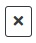
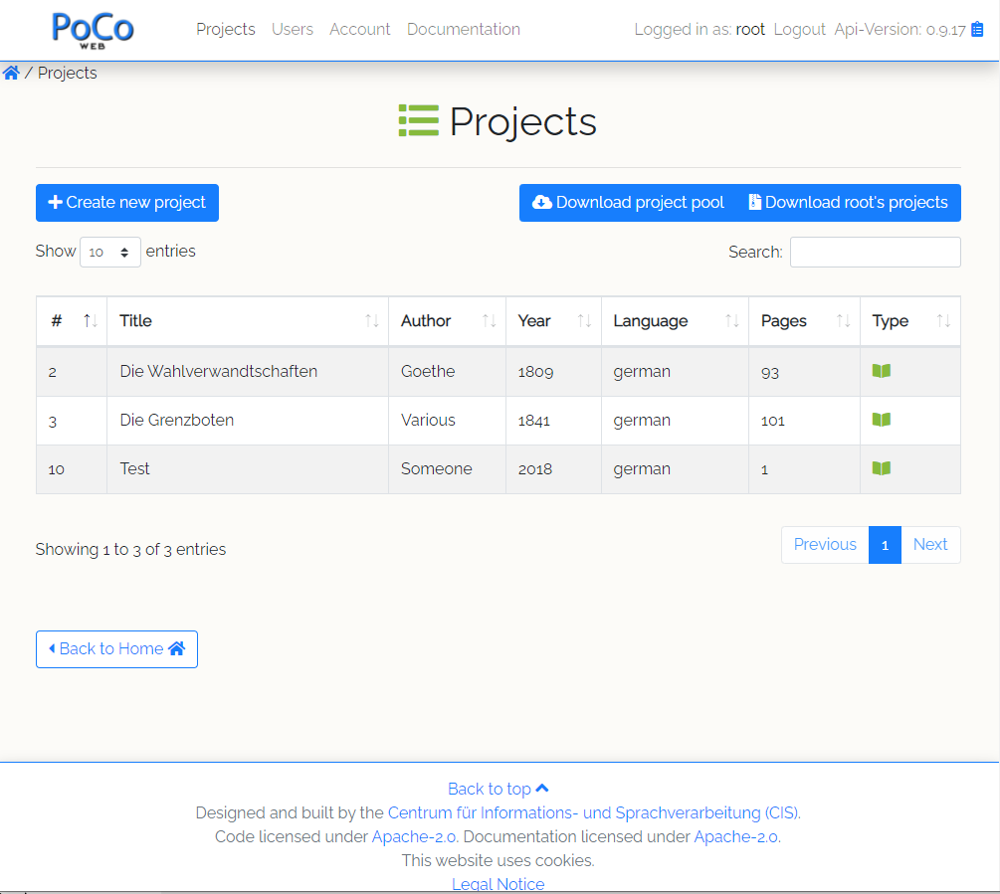

PoCoWeb is a web based post-correction system for OCRed historical
documents.  It is based on
[PoCoTo](https://github.com/cisocrgroup/PoCoTo).  PoCoWeb consists of
a backend that offers a REST API for the post-correction and a
frontend that facilitates the post-correction of historical documents
using a web-browser.

Users can upload their OCRed documents and correct them in the web
front end.  The corrected documents can then be downloaded and further
processed.  PoCoWeb understands various OCR formats that can be used.
Any corrections are written back into the original format of the
documents.  This makes it possible to integrate the manual
post-correction of OCRed documents into other digitalisation
work flows.

As PoCoTo, PoCoWeb is connected with a language
[profiler](https://github.com/cisocrgroup/Profiler) that enables
semi-automatic correction of historical documents.  The profiler is
able to differentiate between historical spelling variation and real
OCR errors in the documents and generates correction suggestions for
suspicious words.
<p align="center">

</p>

PoCoWeb offers:
* Simple user management to enable parallel correction of documents
  packages.
* The possibility to split documents into packages to parallel the
  manual post-correction.
* A connection to the language profiler that:
  * generates correction suggestions.
  * lists suspicious words and error patterns.
  * adapts to the manual correction on the document.
* An interface to an automatic correction system that:
  * uses the language profiler.
  * automatically generates lexicon extensions for the profiler.
  * corrects the document
  * allows for interactive manual inspection of the correction.
* The possibility to download a global pool of corrected lines in the
  whole corpus to be used for OCR-training etc.
* An extensive REST API to enable the automation of different aspects
  of the post-correction.

- - -
## Table of contents
* [Login](#user-content-login)
* [Users](#user-content-users)
  * [Account settings](#user-content-account-settings)
  * [User management](#user-content-user-management)
* [Projects](#user-content-projects)
  * [Creating new projects](#user-content-upload-new-project)
  * [Project archives](#user-content-project-archives)
  * [Project overview](#user-content-project-table)
  * [Deleting of projects and packages](#user-content-delete-projects)
  * [Splitting and reclaiming of projects and packages](#user-content-split-projects)
  * [Downloading projects](#user-content-download-project)
  * [Profiling projects](#user-content-profile-project)
* [Post correction](#user-content-post-correction)
  * [Page correction](#user-content-page-correction)
  * [Navigation bar](#user-content-navigation-bar)
  * [Concordance view](#user-content-concordance-view)
* [Installation](#user-content-installation)
* [Grond-truth pool](#user-content-pool)
* [Services](#user-content-overview-services)

<a id='login'></a>
## Login
In order to use PoCoWeb, each user has to login with an appropriate
user account using the login link at the right top of the page.  Users
can logout again using the logout link at the same position.
<p align="center">

</p>

<a id='users'></a>
## Users

In general there are two kinds of user accounts in PoCoWeb.  The two
types have differen permissings in the system:

1. Administrator accounts
   * Create new administrator and normal users accounts
   * Delete user accounts
   * Upload new documents and create new
     [projects](#user-content-projects)
   * Split projects into [packages](#user-content-projects)
   * [Assign](#user-content-split-projects) packages to different user
     accounts
   * [Profile](#user-content-profile-project) projects.
   * [Post correct](#user-content-post-correction) projects and
     packages.
   * [Delete](#user-content-delete-projects) documents and packages.
   * [Download](#user-content-download-project) corrected projects.
   * Download a [pool](#user-content-pool) of corrected projects.
2. Normal user accounts
   * Post correct [packages](#user-content-projects) that
     where assigned to them
   * [Profile](#user-content-profile-project) projects.
   * [Reassign](#user-content-split-projects) packages back to their
     original owner.

- - -
<a id='account-settings'></a>
### Account settings

Users can manage their account settings using the Account tab on the page.
Each user can only manage their own user's settings.  It is not possible to change
the settings of another user account even if you are logged in with an
administrator account.
<p align="center">

</p>
In order to update user settings or to change the user's password,
fill in or change the appropriate fields and click on the 
button.

If you want to delete your account click on the  button.  This
will delete the user and all its projects and packages.  Use with
caution.

Note: Using the account settings is the only way to delete an
administrator account (see [User
management](#user-content-user-management) below).  So in order to
delete an administrator account one has to login with the account and
delete it using the account settings page.

- - -
<a id='user-management'></a>
### User management

User management is done via the User tab.  You have to be logged in
with an administrator account in order to access and use the user
management page.
<p align="center">

</p>
The user management page consist of an overview list of all users in
the system.  In order to remove a user account (the user cannot be an
administrator), click on the
 button in the
according user entry in the user table.

To delete an administrator account log in with this account, go to the
[Account tab](#user-content-account-settings) and click to the  button.

To create new user accounts Click to the  button and fill
out the input fields accordingly.  If the account should be an
administrator account, do not forget to check the  check box.
<p align="center">

</p>


<a id='projects'></a>
## Projects

Project management is done via the project tile or the project tab.
This page lists all available projects and packages (see below) that
your user owns.  On this page you can upload new project archives (see
below). In order to process a project or package simply select the
appropriate entry in the project table.

<p align="center">

</p>
In the list you can see some basic information about the available
projects and packages.  Projects and packages are marked with either
the project symbol  or the package symbol
.

From this page you can also [create new
projects](#user-content-upload-new-project) and download a
[pool](#user-content-pool) of all you user's projects or all globally
pooled projects.

PoCoWeb uses two different kinds of correctable documents.  *Projects*
on the one hand represent whole documents or books that should be
corrected.  *Packages* on the other hand are smaller subsets of
projects that contain a subset of the pages of their parent project.
Two packages with the same parent never contain overlapping pages.
This makes it possible for two different users to correct different
packages of the same project in parallel.

Only administrators can upload new projects, split them into a number
of packages and assign those packages to different users.  It is not
possible to assign an existing project to a different user.

<div class='doc-note'> Note: Since it is possible to correct a whole
project as well, one should never correct a project while other users
could be correcting an associated package.  This could lead to cases
where one user accidentally overrides an other users work. </div>

<div class='doc-note'> Note: For historical reasons the api uses the
term «books» to refer to projects and the term «projects» to refer to
packages.  So for example in the REST API `projectId` refers to the id
of a package and `bookId` refers to the id of a project.  Hopefully
this issue can be solved soon. </div>

<a id='upload-new-project'></a>
### Creating new projects

If you are logged in with an administrator account, you can create a
new project.  Fill in the meta data fields in the mask, select the
according [project archive](#user-content-project-archives) on your
computer and click on the
 button.  Depending on
the size of the project archive, the uploading of the project can take
a while.

Do not forget to set the right language for the new project if you are
planning to use the profiler.  The language field lists all available
languages for the chosen profiler.
<p align="center">

</p>

The [PoCoWeb back-end](#user-content-PoCoWeb-backend) analyzes the
project archive, processes its OCR and image files and publishes the
project.  If the uploading was successfully, you should see the new
project in the project table.

The project's author, title and year can be filled out as it seems
fit.  Theses values are not used internally and are there for an easy
reference.

A project's profiler and its language are settings specific for the
language profiler.  If you plan to use a profiler for the post
correction of your project, you have to set them accordingly.  The
normal installation of PoCoWeb comes with a local configured profiler,
you can use `default` or `local` as value for your profiler.  If not
or if you want to use another profiler, you have to specify its URL.

<a id='project-archives'></a>
### Project archives

A project archive is a zipped directory structure that contains the
OCR and image files for the pages of a document.  Image files should
be encoded as PNG files if possible, but specify or TIFF encoded
images are fine, too.  The OCR files should be either [ABBYY-XML](),
[ALTO-XML](), [PAGE-XML]() or [hOCR]() encoded files.

The back-end tries its best to automatically search and order the
pages in project archives.  Therefore the matching OCR and image files
should have the same name (without the extension).  It does not matter
in which directory structure the different image and OCR files reside.
If the matching OCR and image files do have the same filenames for any
reason, you can add a [METS/MOTS]() meta data file to the archive, in
which the page ordering and the association between image and OCR
files is specified.

Example structure of a project archive:

```
archive
├── img
│   ├── page-0001.png
│   ├── page-0002.png
│   └── page-0003.png
└── ocr
    ├── page-0001.xml
    ├── page-0002.xml
    └── page-0003.xml
```

There is no need to separate the image and OCR files with different directories.
You can also use a flat directory structure:
```
archive
├── page-0001.png
├── page-0001.xml
├── page-0002.png
├── page-0002.xml
├── page-0003.png
└── page-0003.xml
```

It is also possible to have the files in a page directory structure like this:
```
archive
├── page-0001
│   ├── page.xml
│   └── page.png
├── page-0003
│   ├── page.xml
│   └── page.png
└── page-0002
    ├── page.xml
    └── page.png
```

If you use [ocropy](https://github.com/tmbdev/ocropy),
you can also use its project structure directly to upload a project archive:
```
archive
└── book
    ├── 0001.png
    ├── 0001
    │   ├── 010001.bin.png
    │   ├── 010001.txt
    │   └─ ...
    ├── 0002.png
    ├── 0002
    │   ├── 010001.bin.png
    │   ├── 010001.txt
    │   └─ ...
    ├── 0003.png
    └── 0003
        ├── 010001.bin.png
        ├── 010001.txt
        └─ ...
```

<a id='project-table'></a>
### Project overview

If you select a project or package the system opens the project
overview.  Depending if you are handling a project or package and if
you are logged as normal user or as administrator you will see a
different page with different edit options.
<p align="center">

</p>
On the top the system presents you some basic information about the
project.  Below you see the correction status of the project, listing
the percentage of corrected lines and tokens and the (estimated) word
error rate of the project.

<div class='doc-note'> Note: The word error rate is based only on the
manually corrected tokens.  As long as not all tokens are manually
corrected, the number is only a rough estimate.</div>

Below is a list of tiles that offer access to different edit options
(the actual list may be missing some of the tiles):
1. Click on the __Order Profile__ tile to
   [profile](#user-content-profile-project) the project.
2. Click on the __Automatic Postcorrection__ tile to start the
   automatic post-correction.
3. Click on the __Manual Postcorrection__ tile to start to [manually
   correct](#user-content-post-correction) the document.
4. Click on the __Adaptive tokens__ tile to get a list of the
   adaptive tokens (manually corrected tokens) in the project.
5. Click on the __Split__ tile to
   [split](#user-content-split-projects) a project into packages.
6. Click on the __Edit__ tile to edit the meta information about
   the project.
7. Click on the __Download__ tile to
   [download](#user-content-download-project) the project.
8. Click on the __Delete__ tile to
   [delete](#user-content-delete-projects) this project.
9. Click on the __Reclaim package__ tile to
   [reclaim](#user-content-split-projects) all packages for the
   project.

<a id='delete-projects'></a>
### Deleting projects and packages
Both projects and packages can be deleted.  If you delete a package
only the according package is deleted.  No content of the parent
project is touched.  On the other hand, if you delete a project all
content is deleted and is irretrievable lost.

You cannot no delete a project that contains packages.  So in order to
delete a project one has to [reclaim](#user-content-split-projects)
all packages and delete them beforehand.

<a id='split-projects'></a>
### Splitting and reclaiming of projects and packages

You can split a project into different packages and assign each
package to a different user (both normal and administrators).
Packages are generated by distributing the pages of the project as
evenly as possible among the packages.  You can select to randomly
distribute the pages instead of sequentially assigning them.
<p align="center">

</p>
If you are the owner of a project, you can forcefully reclaim all
packages.  If you are assigned a package you can reassign it to the
project's owner.

<a id='download-project'></a>
### Downloading projects

You can download an archive of a project.  It is not possible to
download archives of packages.  The PoCoWeb back-end will then
generate a project archive and you will be asked a location to store
the archive.

The project archive will retain the same structure as the project archive,
that was used to create the project. All corrections are written back into
the original OCR files.

Additionally the archive contains a list of all adaptive tokens of the last
profiler run over the document and a page an line segmented directory structure,
that can directly be used with ocropy.

<a id='profile-project'></a>
### Profiling projects

You can order a document profile for packages and projects.  If you
order a profile for a sub package, the profiler will be run over the
package's parent project.  There can always be only on profiling
process for a document.  More generally there can always be only one
background job (profiling, lexicon extension or automatic post
correction) for any project.

The profiling is done in the background. If the profiling is done,
various helpers are available for the post correction of the profiled project
and its associated packages:
* You will see a list of suspicious words in the manual correction.
* You will see a list of frequent error patterns in the manual correction.
* You will be able to inspect the list of adaptive tokens.

After the profiling is done, you can inspect the list of *adaptive
tokens*.  Adaptive tokens are generated by the profiler.  Whenever a
manually corrected token is found during the profiling, the profiler
tries to match the correction to a known dictionary entry.  If no such
match can be generated, a new adaptive token is generated and inserted
into a temporary dictionary for this document. For this reason
Adaptive tokens are possible candidates for new dictionary entries.

For more information about the profiling and adaptive tokens
see the [profiler paper]() and [profiler paper 2]()

- - -
<a id='post-correction'></a>
## Post correction

After clicking on the __Manual Postcorrection__ tile you will be
directed to the project's or package's first page and you can start to
manually post-correct the first page.  In generally the post
correction is the same for projects an packages.  Every statement
about the correction of projects also applies to the correction of
packages.
<p align="center">

</p>
Other than PoCoTo the post correction with PoCoWeb is line based.
Generally you correct whole lines of the document and not single tokens.
The page correction view presents the lines of the document and lets
you correct each line individually.

<a id='page-correction'></a>
### Page correction

The page correction view shows the lines of a page of the project.
You can use the forward and backward buttons of the navigation bar to
go to the next, previous first and last pages of the project.  It is
also possible to directly select specific pages of the project.
<p align="left">

</p>
For each line the image of the line and the according OCR text are
shown.  Lines and tokens are marked with green if they have been
manually corrected or in orange if the according lines or tokens have
been automatically corrected (either by a script or by the automatic
post-correction system).

If you click in the text you can edit the whole line.  After you have
corrected a line you can click on the
 button to correct the
line and send the correction to the back-end After the whole line has
been corrected, the line it is shown with a green background to mark
it as manually corrected.
<p align="center">

</p>
In general you can insert every character into the text field.  There
are no special characters or escape sequences that get by the input
field interpreted.  The only exception are the special escape
sequences of the form `\\u017f` or `\\u{10FFFF}` that can be used to
enter arbitrary Unicode points into the text field. E.g
`Wa\\u017f\\u017fer` gets interpreted as `Waſſer`.  In the unlikely
case that you have to literally insert something like `\\u017f`, you
can use an additional leading `\\` to escape the special
interpretation of the sequence: `\\\\u017f`.

If you are editing a line, you can hit the _Enter_ key to correct the
current line.  You can use the _Up_ and _Down_ arrow keys to navigate
to the previous or next line.

You can click on the __Show line image__ button to see an overview
over the whole line's page image.  On the bottom of the view there is
a button __Set whole page as corrected__ to correct all lines on the
page in on go.

It is also possible to select single tokens in a line, by marking them
with the mouse. If a token is selected, you can choose a correction
candidate for it or list all occurrences of the token in the
[concordance view](#user-content-concordance-view).

<a id='navigation-bar'></a>
### Navigation bar

The navigation bar lets you navigate the pages of you project.  It
stays on the left side of your browser's screen even while you
navigate down the browser page.

Besides the navigation buttons, the navigation bar shows a tab to list
the assumed error patterns (_OCR error patterns_) and error tokens
(_Suspicious words_) of the project.  If the project was profiled
these list assumed errors in the document by the number of their
occurrence or by their common error patterns.  Click one of the
entries to open the [concordance view](#user-content-concordance-view)
of the according token or error patterns.


There is also a list of _special characters_ available.  If you click
on one of the special characters the according Unicode point is
inserted into your clip board (you can use CTRL+v to paste the
character into a text field).  Special characters are all non ASCII
characters encountered in the document.

In the _display settings_ tab you can set options for the displaying
of pages.  These settings are user specific and are only saved in your
browser's local storage and not in the back end.

<a id='concordance-view'></a>
### Concordance view

The concordance view lists tokens in their line context.  These tokens
can be corrected individually or all at once.  The concordance view
never shows manual corrected tokens, since its purpose is the manual
correction of tokens in the project.  If a token gets manually
corrected, it can never be found in the concordance view.

Depending on how you opened the concordance view, you will see a list
of similar words (using suspicious words or the concordance button for
a selected token) or words where the profiler assumes a similar OCR
error pattern for its best interpretation.
<p align="center">

</p>
Each matching token is shown in a blue outline. All matched tokens can
be individually corrected using profiler suggestions or manual
editing.  It is also possible to globally batch-correct the shown
tokens using the correction bar at the top of the concordance
view. All inputs allow the insertion of Unicode escape codes.

After one or more tokens have been corrected, a new batch of tokens is
shown (if there are more to show).  It is possible to set the number
of tokens per page in the _display settings_ tab of the [page
correction](#user-content-page-correction).

- - -
<a id='installation'></a>
## Installation
PoCoWeb is open source software and is distributed under the
[Apache 2.0](LICENSE) license.
You can download the source code from its
[github repository](http://github.com/cisocrgroup/pocoweb).
Installation instructions can be found in the project's
[README](https://github.com/cisocrgroup/pocoweb/blob/master/README.md)
file.

PoCoWeb can be deployed using
[docker-compose](https://docs.docker.com/compose/).  The according
Docker files can be found in the projects's source directory.

- - -
<a id='pool'></a>
## Ground-truth pool
It is possible to download an archive of all corrected lines with
their respective image files.  This pool contains line segmented
ground-truth data and is suitable to be used as training material for
OCR.

Adminstrators can download a pool containing all their [owned
projects](#user-content-api-get-user-pool) or a [global
pool](#user-content-api-get-global-pool) containing data of all
projects in PoCoWeb.  If for some reason a project should not be part
of this global pool it is possible to set the variable `pooled` to
`false` in the projects's settings.

The pool is a zipped archive that contains the line segmented
correction data in a directory structure that is ordered by
project, page ids and line ids:
```
corpus
├── year-author_name1_book_title1.json
├── year-author_name1_book_title1
│   ├── pageid1
│   │   ├── lineid1.gt.txt
│   │   ├── lineid1.txt
│   │   ├── lineid1.png
│   │   ├── lineid2.gt.txt
│   │   ├── lineid2.txt
│   │   └── lineid2.png
│   └── pageid2
│       ├── lineid1.gt.txt
│       ├── lineid1.txt
│       ├── lineid1.png
│       ├── lineid2.gt.txt
│       ├── lineid2.txt
│       └── lineid2.png
├── year-author_name2_book_title2.json
└── year-author_name2_book_title2
    ├── pageid1
    │   ├── lineid1.gt.txt
    │   ├── lineid1.txt
    │   ├── lineid1.png
    │   ├── lineid2.gt.txt
    │   ├── lineid2.txt
    │   └── lineid2.png
    └── pageid2
        ├── lineid1.gt.txt
        ├── lineid1.txt
        ├── lineid1.png
        ├── lineid2.gt.txt
        ├── lineid2.txt
        └── lineid2.png
```

For each project directory, a small JSON-formatted info file is
included. The file has the following layout:

```json
{
  "Author":"author's name",
  "Title":"book's title",
  "Description":"book's description",
  "OwnerEmail":"owner's email",
  "Language": "book's profiler language",
  "ID":3,
  "Year":1900,
  "OCRTXTFiles": [
    "..."
  ],
  "GTIMGFiles": [
    "..."
  ],
  "GTTXTFiles": [
    "..."
  ],
  "Pooled":true
}
```

- - -
<a id='overview-services'></a>
## Services
PoCoWeb is composed from a number of interdependend services:
* nginx serves images, web-content and redirectes API calls
* pcwauth authentificates API requests and forwards them to the various other services
* mysql holds all database tables
* PoCoWeb manages project, packages and the up- and download
* www-data is a directory (volume) that holds the frontend
* project-data is a directory (volume) that holds the project files
* db-data is a directory (volume) that holds the database files
* ocr-data is a direcotry (volume) that holds the global ocr models
* pcwuser handles user management
* pcwprofiler handles profiling of projects
* pcwpostcorrection handles the automatic postcorrection
* pcwpkg handles splitting and assignment of packages
* pcwpool handles download of [pool](#user-content-pool) data


- - -